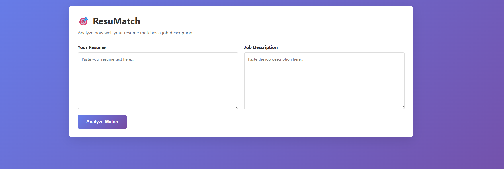
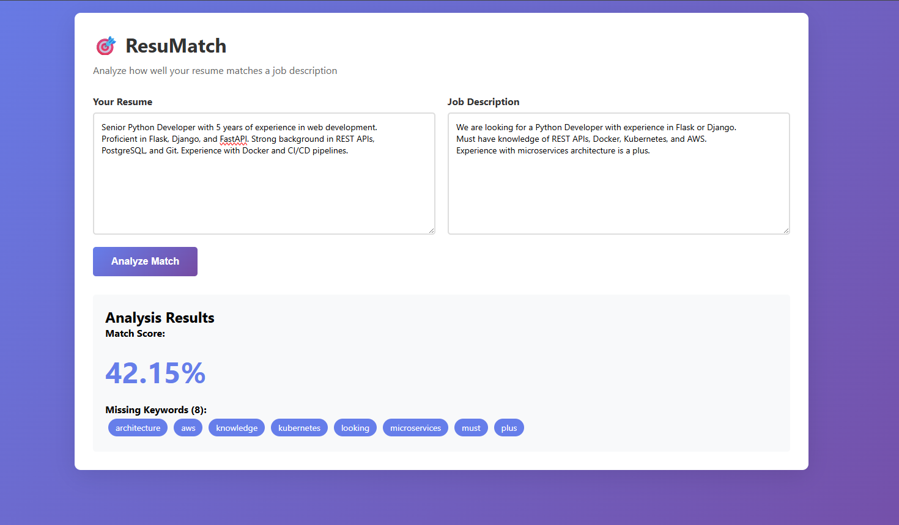

# ResuMatch

A resume-to-job-description matching tool that helps job seekers improve their resumes by analyzing match scores, identifying missing keywords, and providing actionable suggestions.

## Features

- **Match Score Calculation**: Get a percentage score showing how well your resume matches a job description
- **Missing Keywords Detection**: Identify important keywords from the job posting that are missing in your resume
- **File Upload Support**: Upload resumes in PDF, DOCX, or TXT format
- **Flexible Input**: Choose between file upload or direct text paste
- **Clean Web Interface**: Simple, user-friendly interface with smart form handling
- **REST API**: Backend API for programmatic access

## Screenshots

### Main Interface


### Analysis Results


## Tech Stack

- **Backend**: Python, Flask
- **NLP**: NLTK, scikit-learn (TF-IDF vectorization)
- **File Processing**: PyPDF2, python-docx
- **Frontend**: HTML, CSS, JavaScript (separated for maintainability)
- **Algorithm**: Cosine similarity for text matching

## Project Structure
```
resumatch/
├── app.py                      # Flask application entry point
├── src/
│   ├── api/
│   │   └── routes.py           # API endpoints
│   ├── services/
│   │   └── matcher.py          # Core matching algorithm
│   ├── utils/
│   │   ├── text_processor.py   # Text cleaning and keyword extraction
│   │   ├── file_processor.py   # PDF/DOCX file handling
│   │   └── logger.py           # Application logging
│   └── config.py               # Configuration settings
├── static/
│   ├── index.html              # Frontend HTML
│   ├── css/
│   │   └── styles.css          # Styling
│   └── js/
│       └── app.js              # Frontend logic
├── tests/                      # Unit tests (TODO)
├── docs/
│   └── requirements.md         # Project requirements
├── images/                     # Screenshots
├── requirements.txt            # Python dependencies
└── README.md                   # This file
```

## Setup Instructions

### Prerequisites
- Python 3.8 or higher
- pip
- Virtual environment (recommended)

### Installation

1. **Clone the repository**
```bash
   git clone https://github.com/hexbyte-lab/resumatch.git
   cd resumatch
```

2. **Create and activate virtual environment**
   
   **Linux/Mac:**
```bash
   python3 -m venv venv
   source venv/bin/activate
```
   
   **Windows:**
```bash
   python -m venv venv
   venv\Scripts\activate
```

3. **Install dependencies**
```bash
   pip install -r requirements.txt
```

4. **Create `.env` file** (optional, uses defaults if not present)
```
   DEBUG=True
   HOST=0.0.0.0
   PORT=5000
```

5. **Run the application**
```bash
   python app.py
```

6. **Open in browser**
```
   http://localhost:5000
```

## Usage

### Web Interface

1. Navigate to `http://localhost:5000`
2. **Choose your input method:**
   - **Option A**: Upload your resume file (PDF, DOCX, or TXT)
   - **Option B**: Paste your resume text directly
3. Paste the job description in the right textarea
4. Click "Analyze Match"
5. Review your match score and missing keywords

**Note**: When a file is uploaded, the text input is automatically disabled to prevent confusion.

### API Endpoints

#### Health Check
```bash
GET /api/health
```

**Response:**
```json
{
  "status": "healthy",
  "message": "ResuMatch API is running"
}
```

#### Analyze Resume from File
```bash
POST /api/analyze-file
Content-Type: multipart/form-data

Form Data:
- resume_file: PDF, DOCX, or TXT file
- job_description: Job description text
```

**Response:**
```json
{
  "success": true,
  "data": {
    "match_score": 42.15,
    "missing_keywords": ["kubernetes", "aws", "docker"],
    "total_missing": 3
  },
  "resume_preview": "First 200 characters of extracted text..."
}
```

## How It Works

1. **Text Preprocessing**: Both resume and job description are cleaned (lowercased, special characters removed, tokenized)
2. **Keyword Extraction**: Important keywords are extracted using NLTK, removing common stopwords
3. **TF-IDF Vectorization**: Texts are converted to numerical vectors using TF-IDF (Term Frequency-Inverse Document Frequency)
4. **Cosine Similarity**: The similarity between vectors is calculated, giving a match score (0-100%)
5. **Keyword Comparison**: Keywords in the job description that don't appear in the resume are identified as "missing"

## Development

### Running Tests
```bash
python -m pytest tests/
```
(Note: Tests are not yet implemented)

### Code Structure
- `src/api/routes.py`: Flask routes and request handling
- `src/services/matcher.py`: Core matching logic using scikit-learn
- `src/utils/text_processor.py`: Text cleaning and keyword extraction
- `src/config.py`: Centralized configuration

## Future Enhancements

- [ ] Add unit tests
- [ ] Generate improvement suggestions with AI
- [ ] Save analysis history with database
- [ ] Add user authentication
- [ ] Deploy to cloud (Heroku/AWS)
- [ ] Add more sophisticated NLP (BERT embeddings)
- [ ] Support for more file formats (RTF, ODT)
- [ ] Batch processing for multiple resumes

## Contributing

This is a personal learning project, but suggestions and feedback are welcome!

## License

MIT License - feel free to use this project for learning purposes.

## Author

HexByte (Rafi)

## Acknowledgments

- Built following software engineering best practices
- Uses Flask for web framework
- NLP powered by NLTK and scikit-learn
